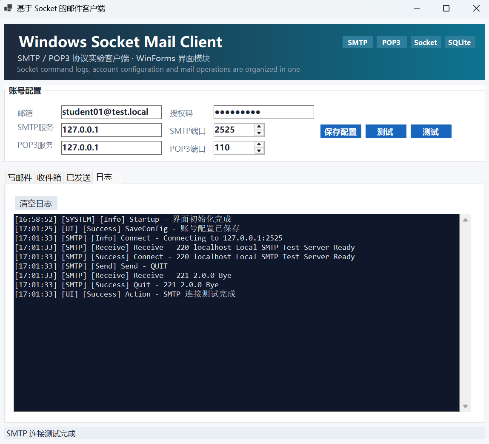
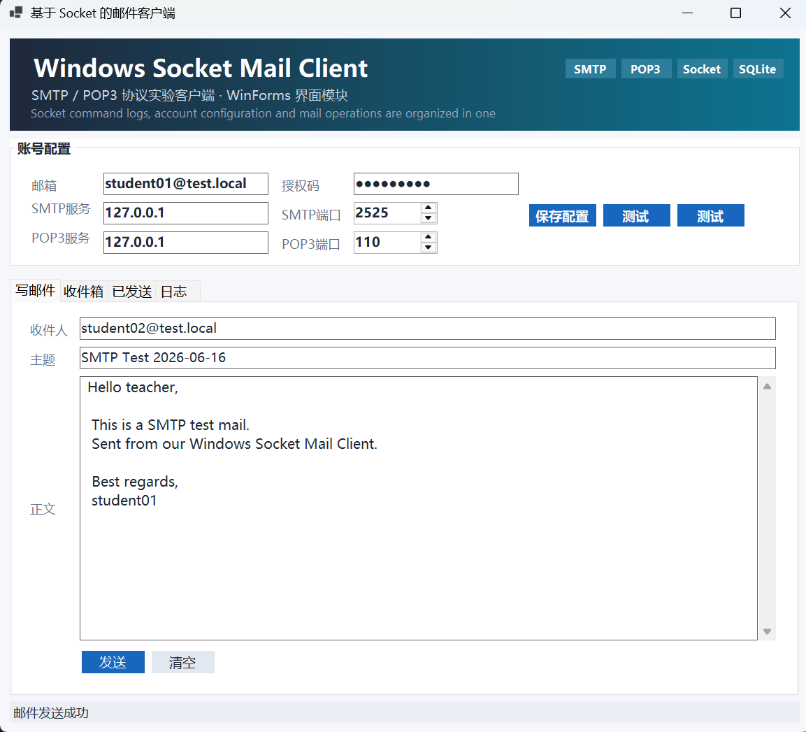
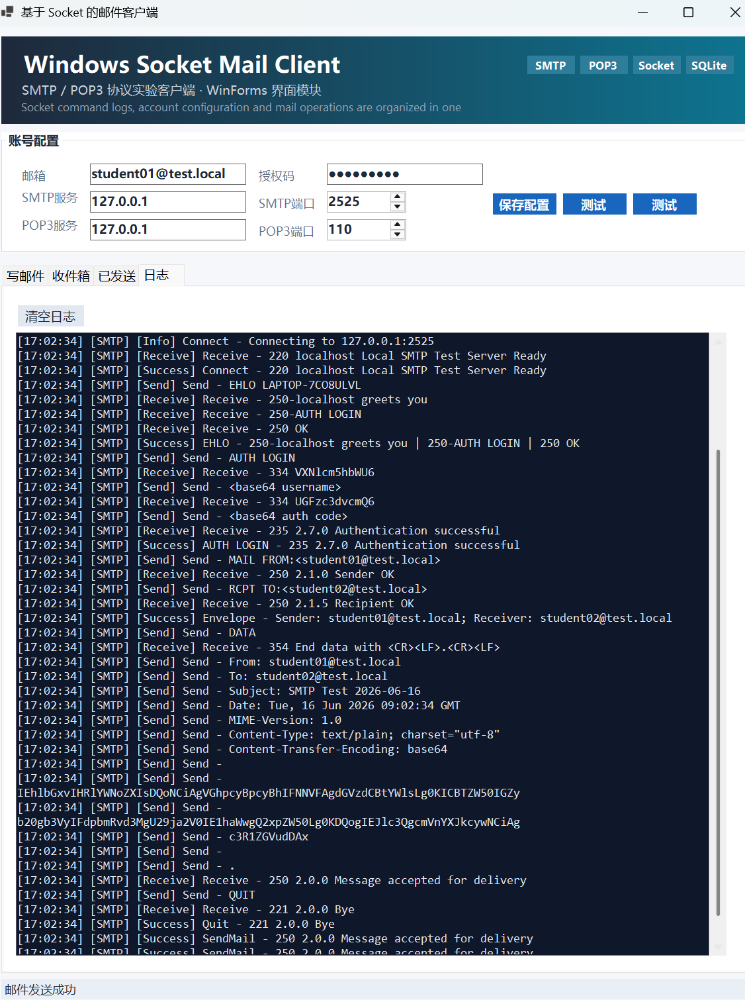
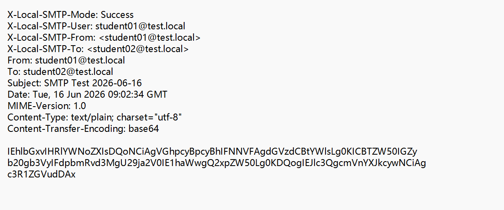
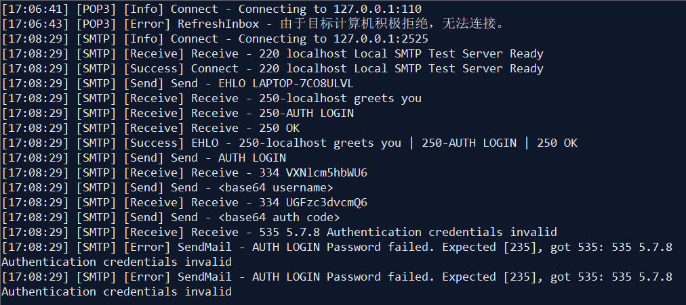
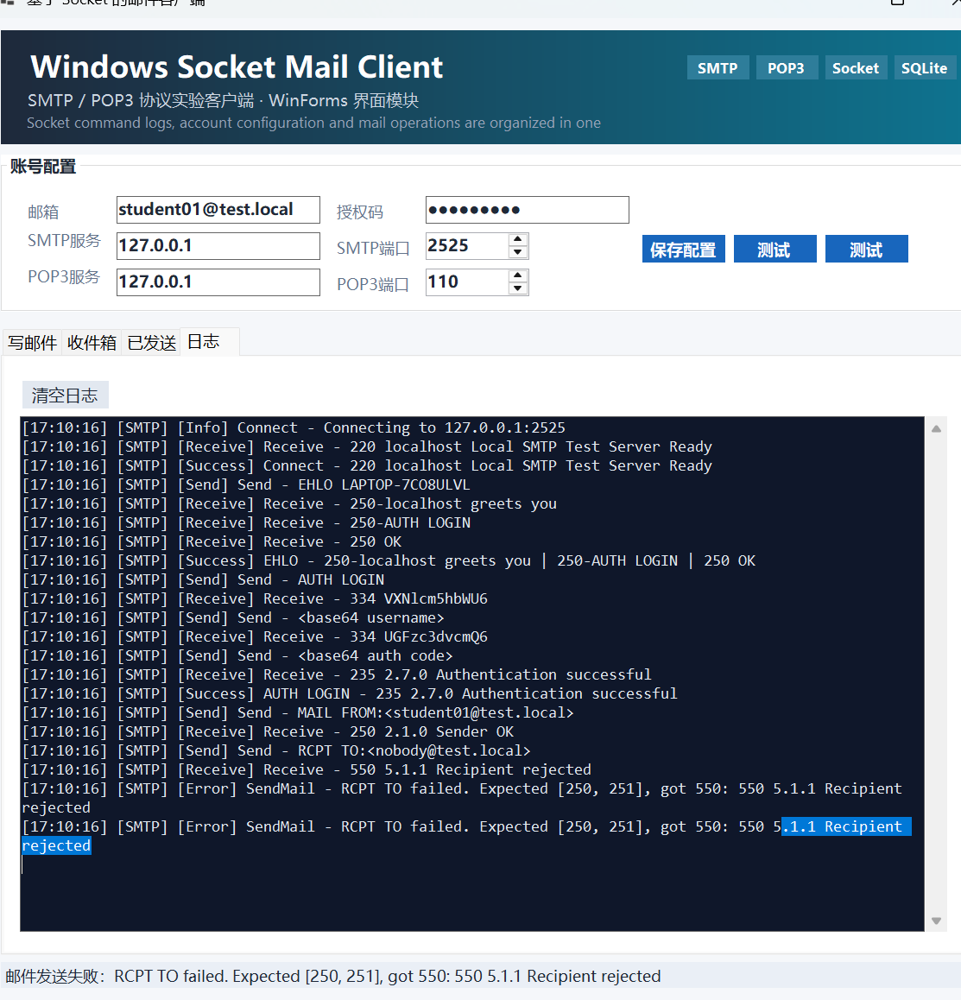
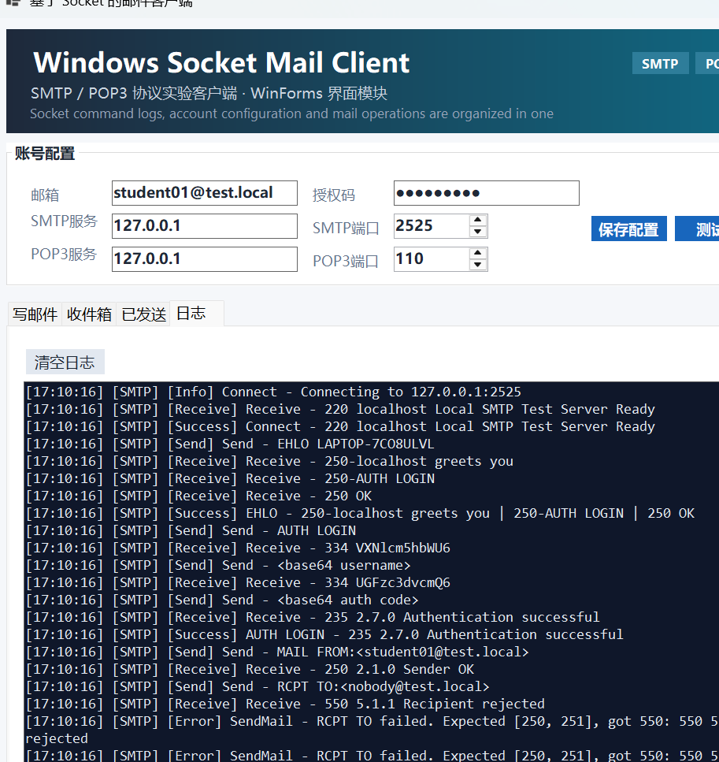

# SMTP 协议实现

## 1. 模块概述

本项目的 SMTP 模块基于 `Socket/TcpClient` 实现，未调用现成邮件发送库，而是按照 SMTP 文本协议的交互顺序，直接与服务器进行命令和响应通信。该模块的主要职责包括：

1. 建立 SMTP TCP 连接。
2. 读取服务器响应并判断响应码。
3. 实现 `EHLO/HELO`、`AUTH LOGIN`、`MAIL FROM`、`RCPT TO`、`DATA`、`QUIT` 等命令流程。
4. 对用户名和授权码进行 `Base64` 编码。
5. 构造普通文本邮件头和邮件正文。
6. 将 SMTP 协议交互过程写入日志。
7. 对认证失败、收件人被拒绝等异常情况进行处理。

本次实验中，由于没有现成可用的明文 SMTP 服务器，而当前客户端版本也未实现 `SSL/TLS` 或 `STARTTLS`，因此测试阶段使用了本地 SMTP 测试服务器，监听地址为 `127.0.0.1:2525`。这样既可以完整演示 SMTP 协议流程，也能独立完成成功和失败场景测试。

## 2. SMTP 连接建立与响应读取

SMTP 会话开始时，客户端首先通过 `TcpClient` 与服务器建立 TCP 连接。连接成功后，服务器应返回 `220` 欢迎响应，表示服务已就绪。客户端读取响应后，对前三位状态码进行解析和判断，只有当返回值为 `220` 时，才允许进入后续 `EHLO/HELO` 阶段。

为了适配 SMTP 协议的多行响应，本模块在响应读取逻辑中区分了两种情况：

1. 若响应行为普通单行，如 `220 localhost Local SMTP Test Server Ready`，则直接解析并返回。
2. 若响应行为多行，如：

```text
250-localhost greets you
250-AUTH LOGIN
250 OK
```

则继续循环读取，直到读到相同状态码且第四位为空格的最后一行为止。通过这种方式，客户端可以正确识别服务器在 `EHLO` 阶段返回的扩展能力信息。

图 1 展示了 SMTP 连接测试过程。在测试中，客户端成功连接本地测试服务器，接收到 `220` 欢迎响应，并在结束测试时发送 `QUIT`，服务器返回 `221`，说明 SMTP TCP 连接建立和基本会话关闭流程实现正确。



## 3. 邮件界面与待发送内容构造

在客户端界面中，用户需要填写 SMTP 服务器地址、端口、邮箱地址、授权码，以及待发送邮件的收件人、主题和正文。发送按钮点击后，程序会先检查账号配置是否完整，再检查收件人和主题是否为空，校验通过后构造 `MailMessageModel` 对象，并调用 SMTP 模块发送邮件。

图 2 展示了发送前的写邮件界面。测试邮件的收件人为 `student02@test.local`，主题为 `SMTP Test 2026-06-16`，正文为普通文本内容。



客户端并不是直接把正文原样发送，而是通过邮件内容构造模块统一生成标准邮件内容，其中包含以下邮件头字段：

```text
From
To
Subject
Date
MIME-Version
Content-Type
Content-Transfer-Encoding
```

其中主题采用 `UTF-8` 编码，正文采用 `UTF-8` + `Base64` 方式发送，以保证普通中文或英文文本都能稳定传输。

## 4. SMTP 命令流程实现

### 4.1 EHLO / HELO

SMTP 会话建立后，客户端首先发送 `EHLO` 命令向服务器表明身份，并获取服务器支持的扩展能力。若服务器成功返回 `250`，则继续后续流程；若 `EHLO` 被拒绝，则客户端自动回退为 `HELO`，保证兼容只支持传统 SMTP 命令的服务器。

### 4.2 AUTH LOGIN 认证

在本实验中，身份认证采用 `AUTH LOGIN` 方式完成。具体步骤如下：

1. 客户端发送 `AUTH LOGIN`。
2. 服务器返回 `334`，提示输入用户名。
3. 客户端对邮箱地址进行 `Base64` 编码后发送。
4. 服务器再次返回 `334`，提示输入密码或授权码。
5. 客户端对授权码进行 `Base64` 编码后发送。
6. 若认证成功，服务器返回 `235`；否则返回错误码，如 `535`。

需要说明的是，`Base64` 只是编码方式，不是加密方式。为了保护敏感信息，日志中不直接输出编码后的真实用户名和授权码，而是以 `<base64 username>` 和 `<base64 auth code>` 进行脱敏显示。

### 4.3 MAIL FROM / RCPT TO / DATA / QUIT

认证成功后，客户端继续执行邮件发送阶段的命令：

1. `MAIL FROM`：指定发件人地址。
2. `RCPT TO`：指定收件人地址。
3. `DATA`：进入邮件内容发送阶段。
4. 发送邮件头和正文。
5. 发送单独一行的 `.` 作为数据结束标记。
6. 服务器返回 `250` 表示邮件被接受。
7. 客户端发送 `QUIT` 并结束会话。

在 `DATA` 阶段，为避免正文内容与 SMTP 结束符冲突，若某一行正文本身以 `.` 开头，程序会自动进行 dot-stuffing 处理，即在最前面补一个点，保证协议格式正确。

## 5. SMTP 成功发送过程分析

图 3 展示了完整成功发送过程的日志。从日志中可以看到：

1. 客户端成功连接服务器并读取 `220`。
2. 发送 `EHLO` 后，服务器返回多行 `250` 响应，并声明支持 `AUTH LOGIN`。
3. 客户端发送 `AUTH LOGIN`，再依次发送编码后的用户名和授权码。
4. 服务器返回 `235 2.7.0 Authentication successful`，说明认证成功。
5. 客户端继续发送 `MAIL FROM` 和 `RCPT TO`，服务器均返回 `250`。
6. 客户端发送 `DATA`，服务器返回 `354` 进入邮件正文输入阶段。
7. 客户端按行发送邮件头和正文，并发送 `.` 结束数据段。
8. 服务器返回 `250 2.0.0 Message accepted for delivery`，表示邮件投递成功。
9. 最后客户端发送 `QUIT`，服务器返回 `221 2.0.0 Bye`，正常结束会话。



从结果可以看出，本模块已经能够完整实现普通文本邮件的 SMTP 发送主流程。

## 6. 本地接收结果验证

由于本次实验使用的是本地 SMTP 测试服务器，因此邮件不会进入真实公网邮箱，而是由测试服务器保存为 `.eml` 文件。图 4 展示了服务器保存的邮件内容，可以看到：

1. 本地测试服务器记录了发送模式、发件人和收件人。
2. 邮件头中包含 `From`、`To`、`Subject`、`Date`、`MIME-Version`、`Content-Type` 和 `Content-Transfer-Encoding` 等字段。
3. 邮件正文以 `Base64` 形式存储，与客户端发送日志中的内容一致。

这说明客户端不仅完成了 SMTP 命令交互，也正确构造并提交了邮件数据。



## 7. 异常处理实现与测试

SMTP 模块不仅要支持成功发送，还必须在失败场景下能够正确判断错误并给出明确提示。本实验重点验证了认证失败和收件人失败两类异常。

### 7.1 认证失败

图 5 展示了认证失败测试结果。在该测试中，客户端向服务器发送错误授权码，服务器返回：

```text
535 5.7.8 Authentication credentials invalid
```

程序检测到该返回值并非认证成功阶段预期的 `235`，因此立即终止后续 `MAIL FROM`、`RCPT TO` 和 `DATA` 流程，同时在日志和状态栏中输出错误信息。该结果说明 SMTP 模块能够正确识别 `AUTH LOGIN` 失败，并给出明确的异常提示。



### 7.2 收件人被拒绝

图 6 和图 7 展示了收件人失败测试结果。在该测试中，客户端认证成功后继续发送 `MAIL FROM` 和 `RCPT TO`，其中服务器对收件人地址 `nobody@test.local` 返回：

```text
550 5.1.1 Recipient rejected
```

程序检测到 `RCPT TO` 返回码不属于预期的 `250` 或 `251`，于是立即判定发送失败，并在日志中输出：

```text
RCPT TO failed. Expected [250, 251], got 550
```

图 6 展示了失败场景的完整界面和日志，图 7 展示了失败日志的局部细节。两张图共同说明：SMTP 模块能够在投递阶段准确识别服务器拒绝响应，并给出明确的错误说明。





## 8. 协议日志设计

为方便调试和实验分析，本模块实现了统一的协议日志输出机制。日志中记录了以下内容：

1. 连接服务器的信息。
2. 客户端发送的命令。
3. 服务器返回的响应。
4. 认证成功或失败结果。
5. 邮件发送成功或失败结果。
6. 退出会话过程。

日志输出采用如下格式：

```text
[时间] [协议] [级别] 操作 - 内容
```

例如：

```text
[17:02:34] [SMTP] [Send] Send - EHLO LAPTOP-...
[17:02:34] [SMTP] [Receive] Receive - 250-AUTH LOGIN
[17:02:34] [SMTP] [Success] AUTH LOGIN - 235 2.7.0 Authentication successful
```

在日志设计中，密码和授权码不会以明文方式输出，保证了实验过程中的基本信息安全。

## 9. 实现结果总结

通过以上实现和测试，本项目的 SMTP 模块已经完成了以下功能：

1. 建立 SMTP TCP 连接并读取欢迎响应。
2. 解析单行和多行服务器响应，并根据响应码判断执行结果。
3. 实现 `EHLO/HELO`、`AUTH LOGIN`、`MAIL FROM`、`RCPT TO`、`DATA`、`QUIT` 命令。
4. 对用户名和授权码进行 `Base64` 编码。
5. 构造普通文本邮件头和正文，完成邮件发送。
6. 在成功和失败场景下输出完整协议日志，并对敏感信息进行脱敏。
7. 对认证失败、收件人被拒绝等异常情况进行明确处理。

当前模块的限制主要包括：

1. 仅支持普通文本邮件。
2. 不支持附件发送。
3. 不支持 HTML 邮件。
4. 不支持多收件人、抄送和密送。
5. 当前版本未实现 `SSL/TLS` 或 `STARTTLS`，因此测试环境主要面向本地或课程实验服务器。

总体来看，本模块已经较完整地展示了 SMTP 应用层协议与 TCP Socket 通信的实现过程，达到了课程设计中“基于 Socket 实现 SMTP 邮件发送”的实验目标。
